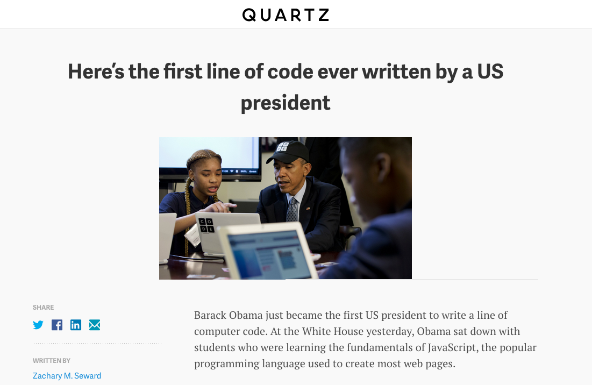

Lesson 21 - More CSS!
========

## [CLICK HERE FOR DO NOW](https://docs.google.com/document/d/1yHDKFHp1tHFLU2fVl4-aM3p2hgBUZuhcKOF81R_m7bc/edit?usp=sharing)

###Bonus Challenge

1. Find `bonus.html` and `bonus.css` in `lesson21/BonusChallenge`
2. Write the HTML and CSS for this webpage!

* Hint 1: Here is the URL for the image: [http://img.qz.com/2014/12/obama-coding.jpg?w=1000](http://img.qz.com/2014/12/obama-coding.jpg?w=1000)
* Hint 2: There are different elements with different `font-family` (CSS property) on this page!
* Hint 3: Try using the `text-align` CSS property!
* Hint 4: Try using the `float` CSS property!

====

###Google Hackathon on Saturday!

Fill out this form: [bit.ly/ScriptEdHackathon](http://bit.ly/ScriptEdHackathon)
